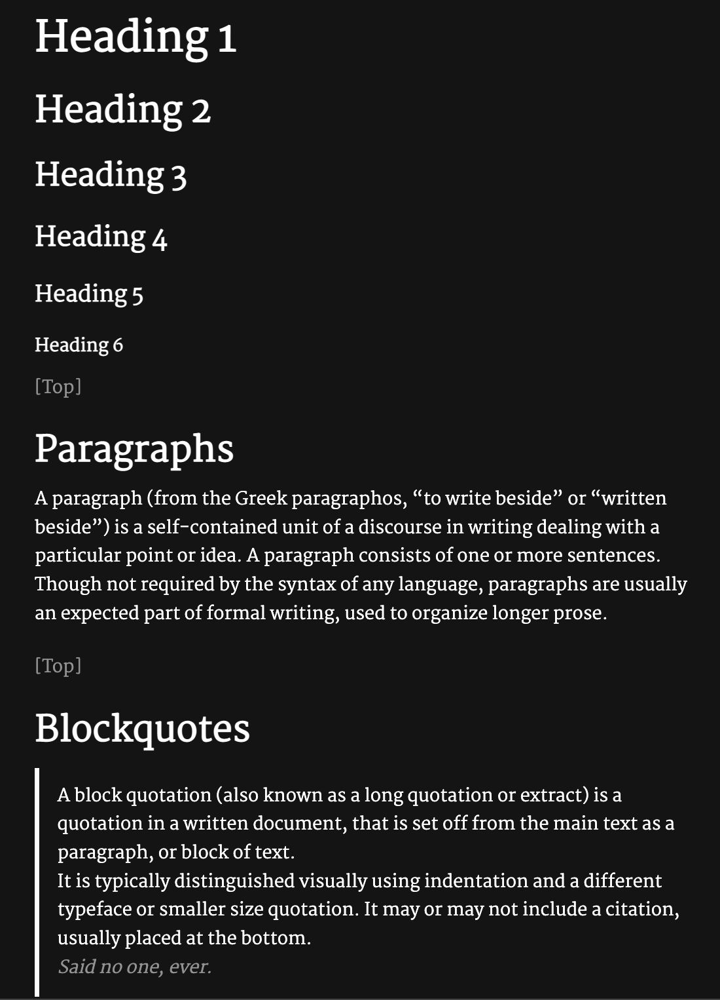

# beech-dark.css
## [Showcase Image](https://y-arjun-y.github.io/beech-dark.css)
<div align="center">
  
</div>

## Description

The dark version of beech.css, a classless CSS theme that makes your website easy on the eyes! Based on [sakura](https://github.com/oxalorg/sakura).

## Installation

1. **CDN**  
   Add this snippet of code in your `<head>` tag.

```html
<link
  rel="stylesheet"
  href="https://unpkg.com/beech-dark.css@1.0.0/style.css"
  type="text/css"
/>
```

2. **NPM**

```bash
 npm install beech-dark.css
```

3. **Yarn**

```bash
 yarn add beech-dark.css
```

Alternatively, you can see the raw CSS file by going [here](https://raw.githubusercontent.com/y-arjun-y/beech-dark.css/main/style.css).

## Credit

sakura: https://github.com/oxalorg/sakura  
HTML5 Test Page: https://github.com/cbracco/html5-test-page
